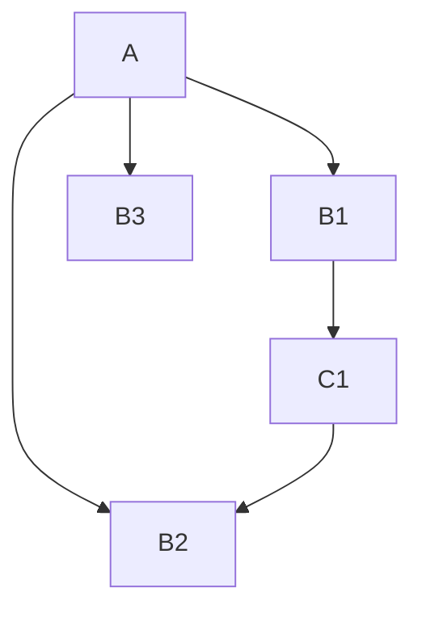
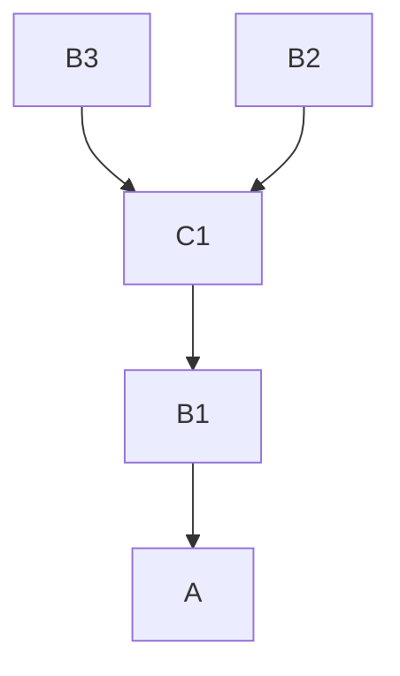
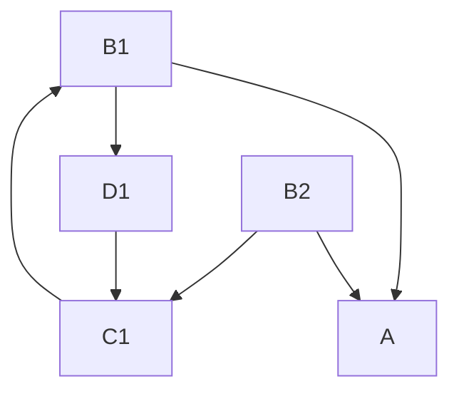

# AeLa.Utilities.SceneDeps

## Overview

When loading a scene, it is often useful to know that certain systems/resources are already initialized/loaded. The Additive Scene Dependencies package allows additive scenes to be defined as dependencies for a given scene or group of scenes, and ensures that dependencies are fully loaded/initialized before the dependent scene is activated.

## How it works

1. Define dependencies in **SceneDependencyList**s and/or custom scripted dependency lists
2. Before a scene is activated call `SceneDependencies.LoadDependencies(String scene)` to load necessary dependencies and unload unused dependencies
3. Once the dependencies are finished loading, activate the dependent scene
4. That's it! If you do this whenever you load any scenes, the dependent scenes will always be loaded/unloaded for you.

> [!NOTE]
> If you're using [AeLa Scene Transition Utility](https://github.com/aestheticianlabs/com.aela.utilities.scene-transition) just add the `STM_SceneDependencyManager` component to your initialization scene to handle steps 2-3!
## Addressables configuration

### Scene Dependency Providers

`ISceneDependencyProvider` assets (**SceneDependencyList**, etc.) that are marked as addressable and labeled with the label `SceneDependencyList` are automatically loaded by `DependencyListsProvider` to be used when `SceneDependencies.LoadDependenciesAsync(string scenePath)` is called.

Here's the recommended configuration:
1. Create a unique Addressables group for the assets.
2. Create a folder like `Assets/Settings/SceneDependencies`.
3. Mark the folder as Addressable and make sure it is included in the group from 1.
4. Add the `SceneDependencyList` label to the folder.
5. Add `ISceneDependencyProvider` assets to this folder. They will be automatically labeled and included in the group!

### Dependency Scenes

Dependency scenes are loaded by path using the Addressables system. How you group your assets is up to your project's needs, but **the dependency scene assets must be keyed by asset path**.

## Preserving dependencies

By default, dependency scenes remain loaded between transitions if they are still needed by the next scene, reducing churn. You can disable this behavior by setting `unloadUnusedDependencies` to `false` when calling `LoadDependenciesAsync`

> [!NOTE]
> If you're using `STM_SceneDependencyManager`, set `STM_SceneDependencyManager.UnloadUnusedDependencies` to `false` before calling `SceneTransitionManager.ChangeScene`. You can also wrap your code in `using(STM_SceneDependencyManager.DisableUnloadUnusedScope())` to ensure that `UnloadUnusedDependencies` is reset to `true`.

## Calculating dependency hierarchy

When we start loading dependencies for a scene, we first collect all of the immediate dependencies for the scene, then resolve all sub-dependencies into a dependency tree. Then, we load all of the scenes simultaneously. Finally we activate them in order such that a scene is activated only after all of its dependencies have been fully loaded and activated.

Let's say that scene `A` depends on scenes `B1`, `B2`, and `B3`.
- Scene `B1` depends on scene `C1`
- Scene `C1` depends on scene `B2`
- Scene `B2` has no dependencies
- Scene `B3` has no dependencies

The dependency tree looks like:

Therefore the load/activation order should be

> [!NOTE]
> We try to activate scenes as early as possible and in parallel. In this case, B3 and B2 can be activated together because they don't have any other down-chain dependencies.

### Algorithm

1. Do a DFS starting at the scene to be loaded and traversing dependent scenes to generate a post-order [topological sort](https://en.wikipedia.org/wiki/Topological_sorting#Depth-first_search) of all the scenes.
	- During this DFS, discover cycles by tracking both `visiting` and `visited` nodes
2. Iterate over the list and determine the depth of each node.
	- Depth = max depth of all dependencies + 1
	- For safety with scripted dependency lists cache the dependency results from 1
3. Group nodes into load groups by order (lower = sooner)
### Circular dependencies

Let's say that scene `A` depends on scene `B1` and scene `B2`.
- Scene `B1` depends on scene `C1`
- Scene `B2` has no dependencies
- Scene `C1` depends on scene `B2` and `D1`
- Scene `D1` depends on scene `B1`
	- Circular dependency created

The dependency tree looks like

This tree can not be resolved into a load order because B1 and C1 are indirectly dependent on each other (via `D1`).

In this case, `SceneDependencies` will throw a `CyclicDependenciesException`